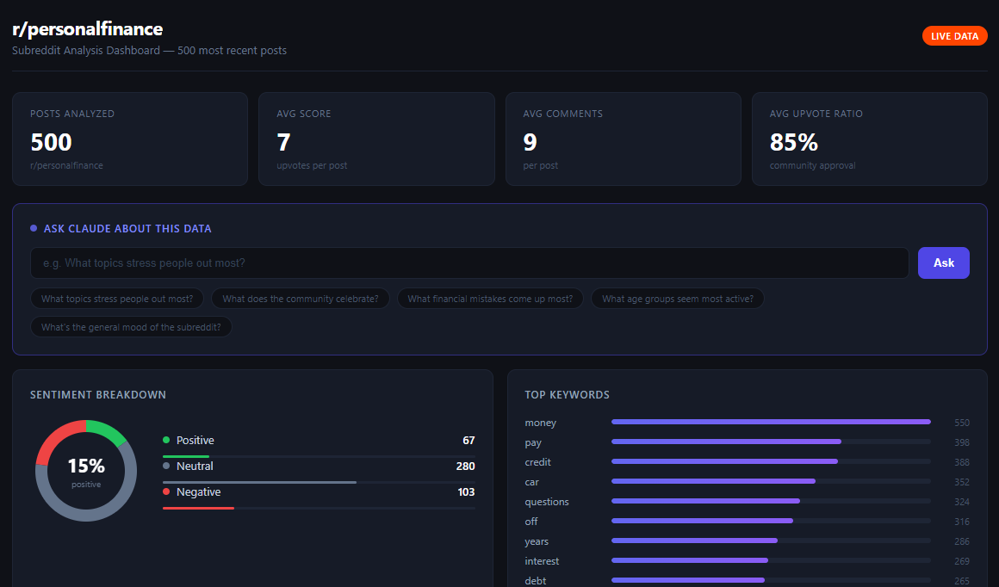
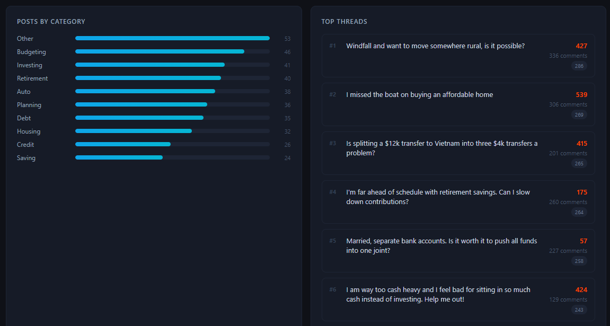
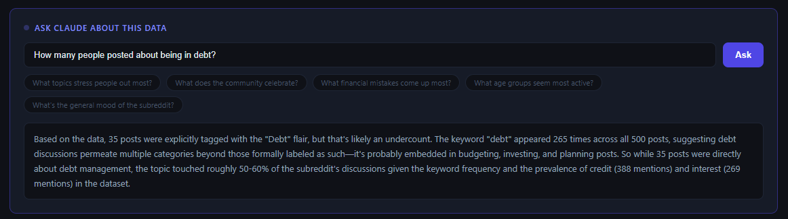

# Subreddit Analysis Pipeline

An end-to-end data pipeline that pulls live Reddit data, runs sentiment and keyword analysis using the Claude AI API, and visualizes everything in a custom interactive dashboard built with Google Apps Script.

Built on r/personalfinance: 500 posts, 2,265 comments, fully analyzed.



---

## What it does

1. **Fetches** posts and comments from any public subreddit using the [Arctic Shift](https://arctic-shift.photon-reddit.com) public Reddit archive API. No Reddit API key required.
2. **Stores** structured data in Google Sheets with clean columns for post metadata, comment bodies, timestamps, flair, and engagement metrics.
3. **Analyzes** the dataset across four dimensions: sentiment (via Claude API), keyword frequency, flair/category breakdown, and top thread scoring.
4. **Visualizes** everything in a custom dark-themed HTML dashboard rendered inside Google Sheets via HtmlService. No external hosting needed.
5. **Powers an AI insight panel** where you can ask natural language questions about the data and get Claude-generated answers grounded in the actual numbers.

---

## Dashboard






The dashboard includes:

- **Stat cards** showing posts analyzed, average score, average comments, and average upvote ratio
- **Sentiment donut chart** with Positive / Neutral / Negative breakdown across all 500 posts, labeled by Claude Haiku
- **Top keywords** frequency-ranked terms extracted from post titles and comment bodies, stopwords filtered
- **Posts by category** flair breakdown showing which topics dominate the subreddit
- **Top threads** ranked by a weighted score combining upvotes, comment count, and upvote ratio
- **Ask Claude panel** where you type any question about the dataset and get a data-grounded answer in seconds

---

## Tech stack

| Layer | Tool |
|---|---|
| Data source | [Arctic Shift API](https://arctic-shift.photon-reddit.com) (public Reddit archive) |
| Storage | Google Sheets |
| Scripting | Google Apps Script |
| Sentiment analysis | Anthropic Claude API (claude-haiku) |
| Dashboard | Apps Script HtmlService (vanilla HTML/CSS/JS) |
| AI insight panel | Anthropic Claude API (claude-haiku) |

---

## Project structure

```
subreddit-analysis-pipeline/
├── Code.gs               # Fetches posts from Arctic Shift API into Google Sheets
├── CommentFetcher.gs     # Resume-able comment fetcher (50 posts per run, cursor-based)
├── Analysis.gs           # Sentiment, keywords, flair breakdown, top threads
├── Dashboard.gs          # Dashboard backend, data loaders, and Claude API call handler
├── DashboardView.html    # Dashboard frontend, charts, panels, AI input
└── README.md
```

---

## How to run it yourself

### 1. Set up Google Sheets

Create a new Google Sheet. Name it anything. Open **Extensions > Apps Script**.

### 2. Add the scripts

Create the following files in Apps Script and paste the corresponding code into each:

- `Code.gs` replaces the default file
- `CommentFetcher.gs` new script file
- `Analysis.gs` new script file
- `Dashboard.gs` new script file
- `DashboardView.html` new HTML file

### 3. Add your Anthropic API key

In Apps Script, go to **Project Settings > Script Properties** and add:

| Property | Value |
|---|---|
| `ANTHROPIC_API_KEY` | your key starting with `sk-ant-...` |

You can get an API key at [console.anthropic.com](https://console.anthropic.com). Running sentiment on 500 posts with Claude Haiku costs roughly $0.05.

### 4. Fetch the data

Run `setupAndFetch()` from `Code.gs`. This pulls 500 posts from r/personalfinance and writes them to a Posts sheet. Takes 8 to 12 minutes depending on API response times.

### 5. Fetch comments

Run `initCommentCursor()` once from `CommentFetcher.gs`, then run `fetchNextCommentBatch()` repeatedly (10 times for 500 posts at 50 per batch). Each run takes about 5 minutes. A Config sheet tracks your progress automatically so you can resume anytime.

### 6. Run the analysis

Run each function from `Analysis.gs` in order:

```
runPostingPatterns()
runFlairBreakdown()
runTopThreads()
runKeywordFrequency()
runSentimentAnalysis()   <- hits Claude API
```

Results are written to an Analysis sheet. Sentiment columns are added directly to the Posts sheet.

### 7. Open the dashboard

Run `openDashboard()` from `Dashboard.gs`. The dashboard opens as a modal dialog inside your Google Sheet.

---

## Sample insights from r/personalfinance

- **85% average upvote ratio** across 500 posts. The community is highly engaged and agreeable.
- **56% of posts are Neutral** in sentiment. Most people are asking questions, not venting.
- **Debt appears 265 times** across the dataset despite only 35 posts carrying the Debt flair, suggesting the topic bleeds into budgeting, housing, and planning discussions.
- **Top thread** "Windfall and want to move somewhere rural, is it possible?" pulled 427 upvotes and 336 comments.
- **Money, pay, and credit** are the three most frequent non-generic keywords across all titles and comments.

---

## Changing the subreddit

To run this on a different subreddit, open `Code.gs` and change:

```javascript
const CONFIG = {
  subreddit: "personalfinance",  // change this to any public subreddit
  ...
}
```

Good candidates: `r/financialindependence`, `r/cscareerquestions`, `r/entrepreneur`, `r/jobs`, `r/investing`

---

## Want this for your subreddit or community?

This pipeline can be adapted to any public subreddit, brand community, or online forum. Whether you want to track sentiment over time, identify what topics your audience cares about most, or build a live dashboard on top of your community data, this can be customized to fit your use case.

Reach out at **shayanalee321@gmail.com** and describe what you have in mind.

---

## Notes

- Arctic Shift is a free public API with no authentication required. The scripts include a 600ms delay between calls by default to stay within rate limits.
- The dashboard runs entirely inside Google Sheets via HtmlService. No server, no hosting, no external dependencies.
- The comment fetcher is resume-able. If it times out mid-run, just run `fetchNextCommentBatch()` again and it picks up from where it left off.
- Sentiment analysis skips already-labeled posts so it is safe to re-run without double-spending API credits.

---

## License

MIT. Use it, fork it, build on it.
